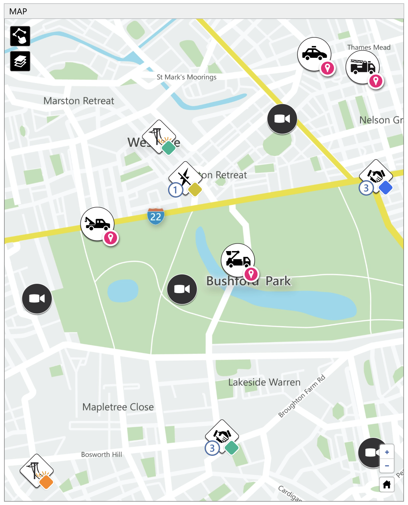
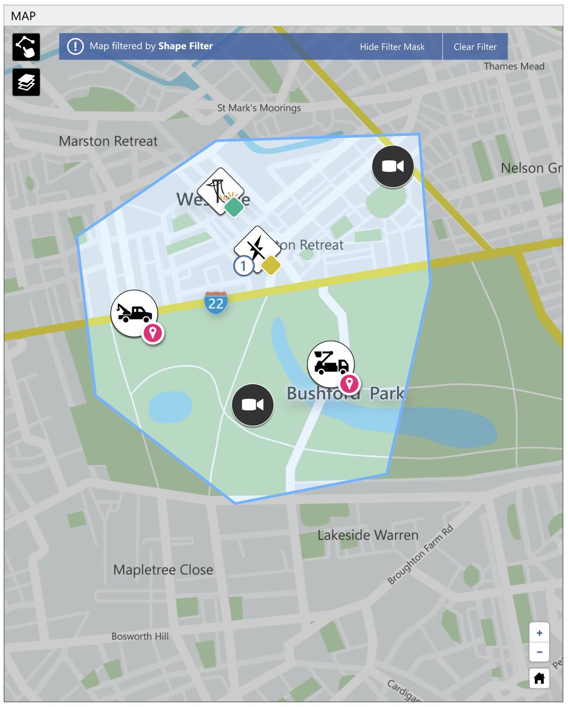
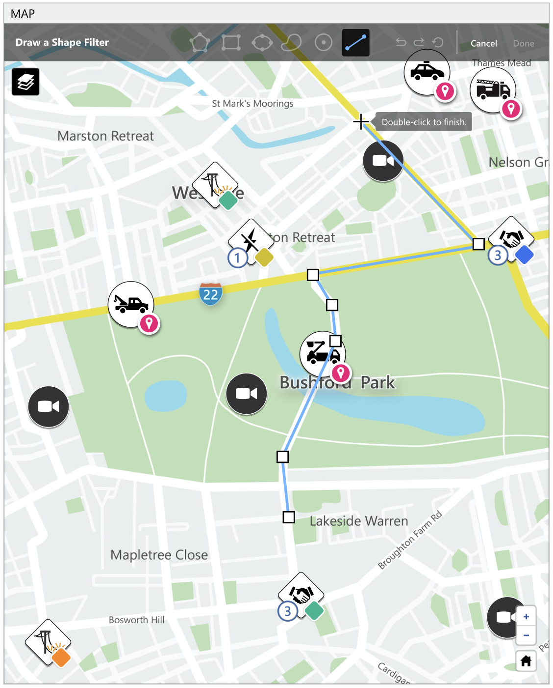
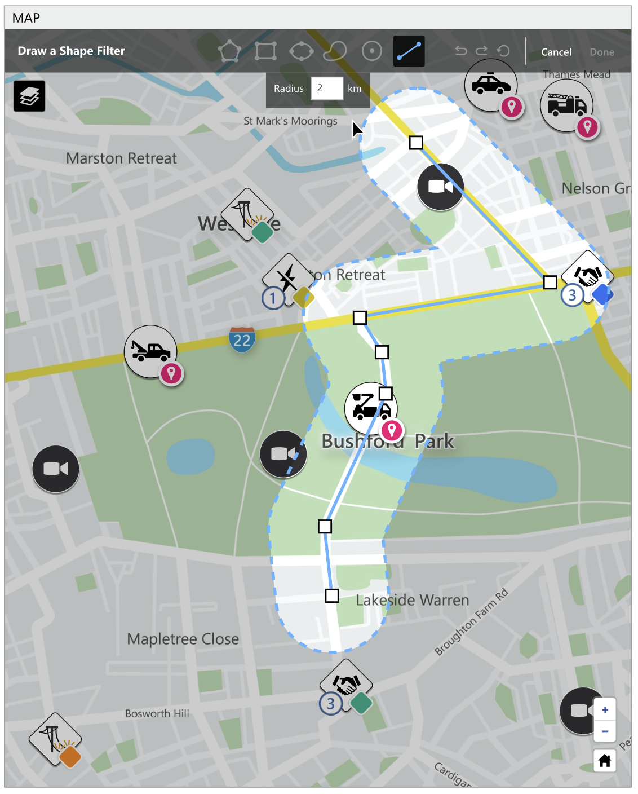
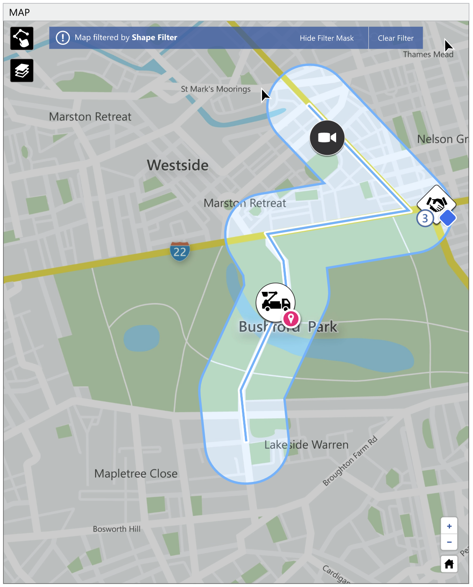

# Brag Documents @ Hexagon

> **HxGN Connect** is a cloud-native, real-time incident center as a service solution that helps you attain full situational awareness, collaborate on shared data and better manage incidents by: [Read more](https://reimaginecollaboration.com/) about HxGN Connect!

## Table of Contents

-   [Statistics](#statistics)
-   [Shape Filters](#shape-filters)
-   Changelogs
-   Create Incident
-   Icon Manager
-   Hierarchical Feature Flags
-   Smaller Stories
-   Platform Packages
-   Platform Package - Unit Tests
-   Localization
-   Recovery Manager
-   Priority Manager
-   Hyperlink
-   Learning Angular
-   Performance Test Tool
-   Training new frontend devs

## Statistics

| Statistic     | Count |
| ------------- | ----- |
| Completed PRs | 782   |

## Shape Filters

### Background

In the HxGN Connect product, there is a map tab where you can view all of the live incidents, assets, and devices.

In order to interact with these assets on the map, users can do so by simply clicking on an icon. However, this map can get more crowded as more assets get added. As a solution to this, we created a feature called **Shape Filters**. This feature allows you to draw shapes on the map that can be used as a boundary to filter out assets.

### Libraries

Currently, the map is created using [Leaflet](https://github.com/Leaflet/Leaflet) and we use [Leaflet.draw](https://github.com/Leaflet/Leaflet.draw) plugin for drawing on top of the map layer.

On top of the polygon shape above, we also have support for rectangles and circles. My job for this task was to implement a new **Line Buffer** shape.

I created a new shape in the gray bar menu with the line icon. On that icon click, the user can click on anywhere on the map to start drawing, then continue clicking to add points, and lastly, double clicking creates the last point.

As the user finishes creating the line, a buffer zone is displayed around the line. This is the actual boundary that will be used in the filter. You can change the size of the buffer from the line in the text input below the menu bar. The default is 2km.

### Research

While the [Leaflet.draw](https://github.com/Leaflet/Leaflet.draw) library supported the line shape, there was no support for creating a buffer zone around the existing shape. I first tested creating an additional shape around the line shape (polygon with a lot of points). While this worked, it would add much more complexity because we now had to manage 2 shapes (line and polygon).

I eventually landed on [Turf.js](https://turfjs.org/). Turf is a relatively large library with a lot of features and good documentation. The library supported [buffer transformation](https://turfjs.org/docs/#buffer) out of the box and also opened the door for many cool features in the future.

Lastly, after the user finishes creating the line shape and setting the buffer radius, the shape filter can be used to remove any assets outside of the boundary.

**Brag Documents**
&copy; Namito Yokota
