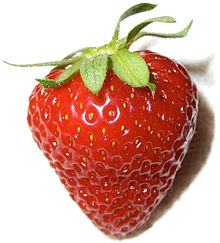
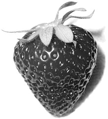
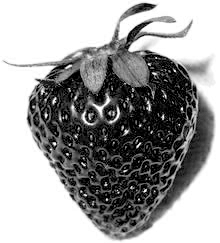

# Grayscale Converter

> Colored PPM image to grayscale PGM images

## Basic Concept

I developed a program that produces six different color to black and white conversion using a PPM image file.

## Installation

```
git clone https://github.com/namitoyokota/grayscale-converter.git
cd grayscale-converter
```

## Usage

| Command        | Description                          |
| -------------- | ------------------------------------ |
| make setup     | creates required directories         |
| make all       | object files created                 |
| make grayscale | converts ppm to pgm grayscale images |
| make clean     | restores repository to original      |

By default, the Strawberry.ppm file is selected as the input image. To change this, import an ppm images under `./img/input` then go to makefile and change all places with `Strawberry.ppm` to your new image file.

## Screenshots






## Resources

The algorithm used for the grayscale operation is from <a href="https://www.johndcook.com/blog/2009/08/24/algorithms-convert-color-grayscale/">John Cook</a>

<hr>

<h4><center>© Namito Yokota </center><h4>
