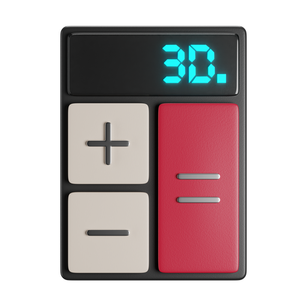
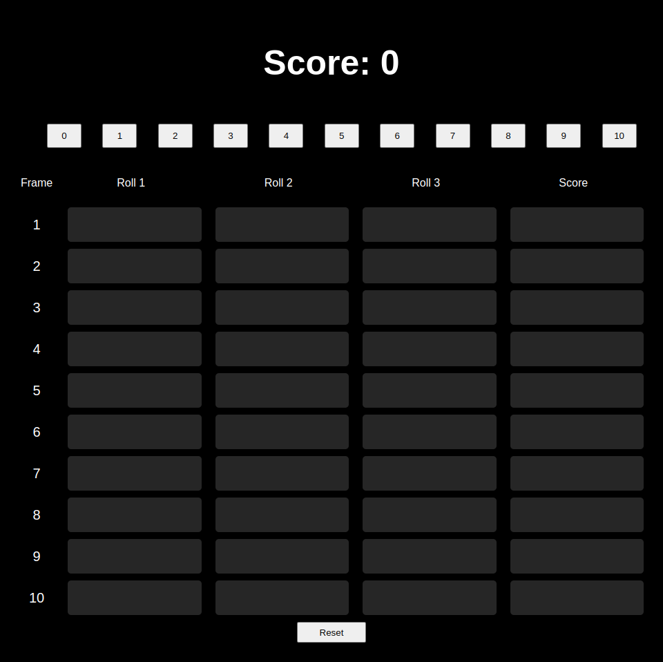

  
  <h2 align="center"><a href="https://bowling.namito.wiki">Bowling</a></h2>
  
Bowling score calculator

 

_This is a project designed for my personal use._

## Objective

The objective of this project is to provide a user-interface for calculating scores from a bowling game.

## Tools

- Angular

